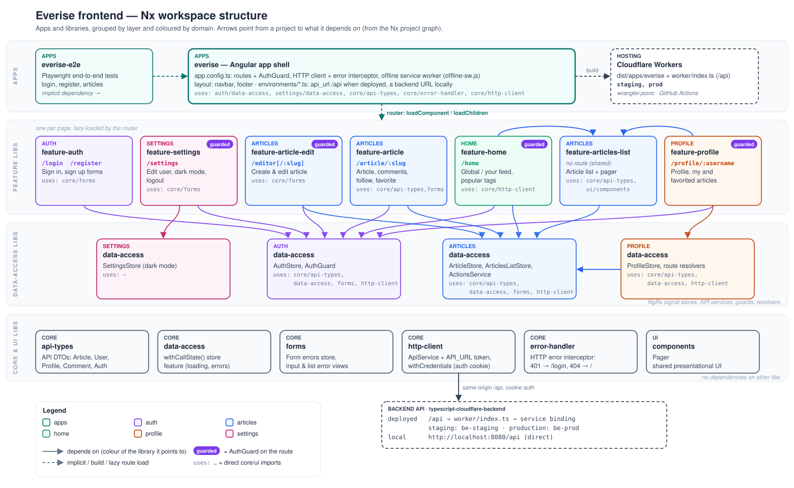
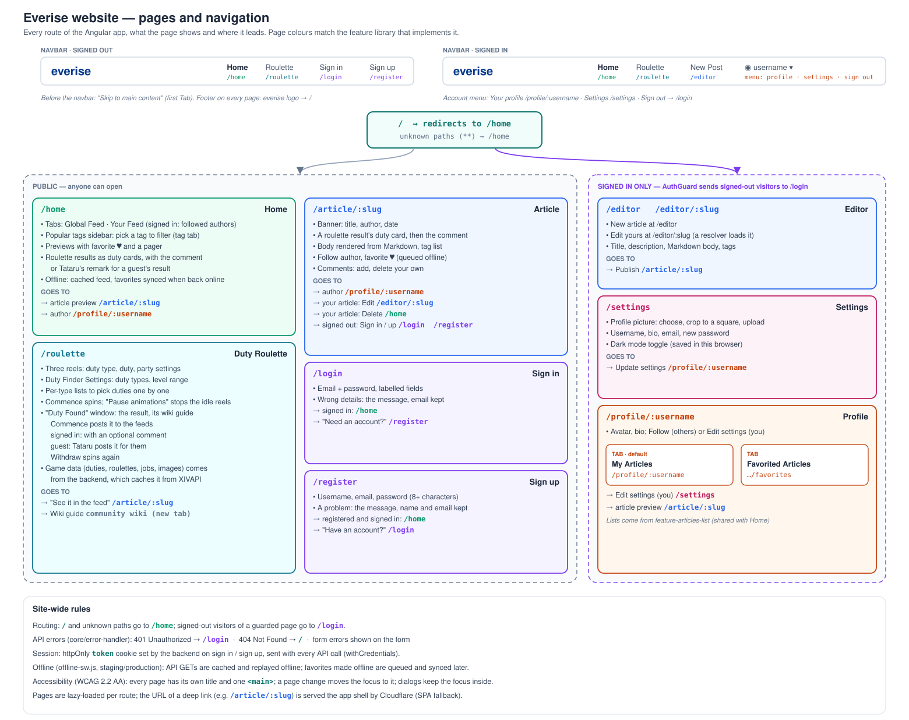

- Conduit project from [Real World](https://codebase.show/projects/realworld?category=backend&language=typescript) adapted to a different forked backend having a firebase hosted DB and a node server for authentication and user management (set up for local use) $${\color{yellow}\[MANUAL\]}$$
- Fixed Profile follow buttons spacing and visibility update, as it wouldn't hide when viewing own profile $${\color{yellow}\[MANUAL\]}$$
- Fixed home and profile paths to be protected by the auth guard $${\color{yellow}\[MANUAL\]}$$
- Added Dark mode option $${\color{yellow}\[MANUAL\]}$$
- Added GET api caching and replay in offline mode with service workers $${\color{red}\[AI\]}$$
- Added posts like in offline mode, synced once back online $${\color{red}\[AI\]}$$

$${\color{red}\[AI\]}$$: Change mainly implemented through the use of AI.  
$${\color{yellow}\[MANUAL\]}$$: Change mainly implemented manually.

## Architecture

### Frontend structure

One Angular app (`apps/conduit`) is a thin shell: routes, guard, HTTP setup and layout. Everything else lives in libraries under `libs/`, grouped by domain (`auth`, `articles`, `home`, `profile`, `settings`) and layered:

- **feature** libs: one per page, lazy-loaded by the router (`feature-articles-list` is the exception: a shared list used by Home and Profile);
- **data-access** libs: NgRx signal stores, API services, guards and resolvers;
- **core** and **ui** libs: API types, HTTP client, form errors, error handling and shared components, with no dependencies on other libs.

Dependencies only point down a layer or sideways within a domain. `npx nx graph` shows the live graph.

### Website structure

Both images are generated: run `node tools/diagrams/frontend-structure.js docs/frontend-structure.svg` (or `website-structure.js`) after changing the structure, then refresh the PNG copy with headless Edge, e.g. `msedge --headless=new --hide-scrollbars --window-size=1560,960 --screenshot=docs/frontend-structure.png docs/frontend-structure.svg` (`1560,1056` for the website image).

## Environments and deployment

The app runs on Cloudflare Workers as static assets and calls the [backend](../typescript-cloudflare-backend) of its environment directly. The backend URL comes from the environment file the build uses:

| Environment | URL                                                   | Environment file                                                               | Backend                                               | Deployed by                                                                               |
| ----------- | ----------------------------------------------------- | ------------------------------------------------------------------------------ | ----------------------------------------------------- | ----------------------------------------------------------------------------------------- |
| local       | http://localhost:4200                                 | [environment.ts](apps/conduit/src/environments/environment.ts)                 | http://localhost:8080/api                             | `npm start`                                                                               |
| staging     | https://conduit-web-staging.denis-coccodi.workers.dev | [environment.staging.ts](apps/conduit/src/environments/environment.staging.ts) | https://conduit-staging.denis-coccodi.workers.dev/api | every merge to `main` ([CI/CD](.github/workflows/ci-cd.yaml))                             |
| production  | https://conduit-web.denis-coccodi.workers.dev         | [environment.prod.ts](apps/conduit/src/environments/environment.prod.ts)       | https://conduit.denis-coccodi.workers.dev/api         | by hand: Actions → Deploy production → Run workflow, only for commits that passed staging |

Local development: start the backend (`npx wrangler dev --port 8080` in the backend repo), then `npm start`. To develop against another backend, change `api_url` in `environment.ts` (the staging and production URLs are there as comments), or run `npm run start:staging` to serve the staging build. `npm run start-sw` builds the app and serves the built files with `wrangler dev`; set `serviceWorker: true` in `environment.ts` to try the offline features.
