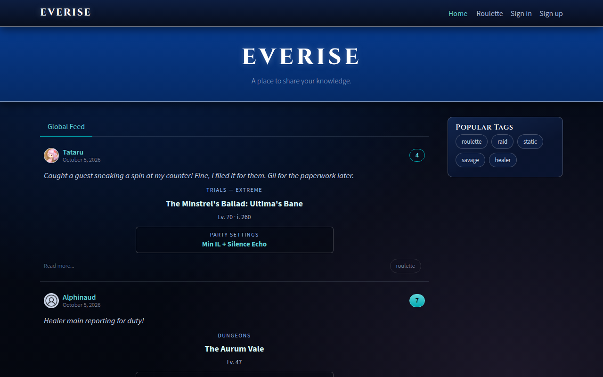
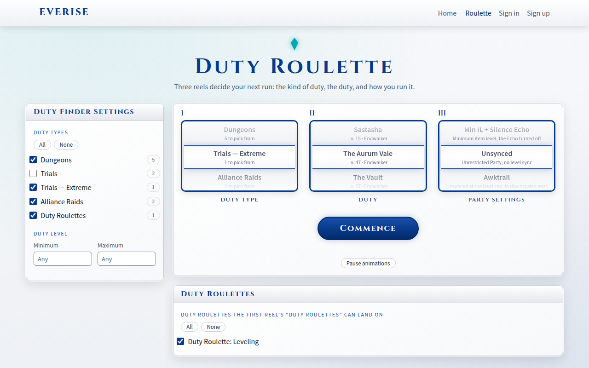
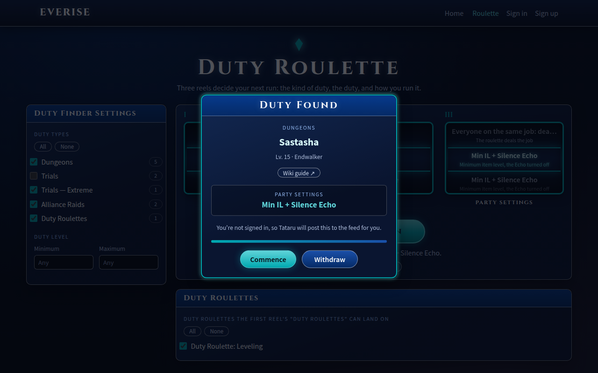

<div align="center">

# ✦ Everise ✦

**The Everise FC community site: a Final Fantasy XIV–themed feed, profiles and a Duty Roulette that posts your next run.**

[](https://github.com/denis-coccodi/everise-frontend/actions/workflows/ci-cd.yaml)


[**everise.dev**](https://everise.dev) · [Backend](https://github.com/denis-coccodi/everise-backend) · [Architecture](#architecture) · [Accessibility](#accessibility) · [Deployment](#environments-and-deployment)



| Duty Roulette (light mode)                                                                                                                   | "Duty Found"                                                                                            |
| -------------------------------------------------------------------------------------------------------------------------------------------- | ------------------------------------------------------------------------------------------------------- |
|  |  |

</div>

## What's inside

- **Feeds.** A public global feed, "Your Feed" of the people you follow, tag filters and paging. Anyone can read; members post, comment, favourite and follow.
- **Live feed.** New posts appear at the top of the global feed (or a tag's list) the moment they're posted, pushed by the backend over a WebSocket (`/api/live`), with a brief highlight and an announcement for screen readers.
- **Duty Roulette** (`/roulette`). Three reels pick the duty type, the duty and how you run it (Min IL, Unsynced, Awktrail, everyone on one job…), from the real game data. **Commence** posts the result to the feeds as a duty card: with your comment when you're signed in, or by **Tataru** for guests.
- **The Waking Sands** (`/waking-sands`). A chat with FINAL FANTASY XIV characters, voiced by an AI on the backend (Workers AI): **Tataru**, **Urianger** and **Y'shtola**, and the free company's own **Barnaby Bollocksworth**, a foul-mouthed braggart whose tales of slaying primals don't add up, and **Bernadette "Bernie" Starling**, a cheerful Astrologian (the healer job) who reads anyone's fortune with her star globe and an arcanum from her deck, by the Twelve (each zodiac sign is the god of the month it starts in: Pisces is Menphina's). One room every member shares, live: members bring characters in or send them out for everyone and talk; after each member's line the characters answer as they see fit (at least one, each up to twice, answering each other too). Lines, who's in and who's writing arrive over the live updates' WebSocket (`LiveUpdates.sands$`), and the page reloads the room whenever the socket (re)connects, so nothing is missed. The room keeps the last day; guests can watch. The backend keeps each member and the site within a daily budget.
- **Party Finder** (`/party-finder`, open to everyone; each data centre has its own page, `/party-finder/light`, which picking it opens). The Party Finder listings up in the game on any data centre (picked by region, Europe first; **Light** from **Odin** to start, **Chaos** next), as [xivpf.com](https://xivpf.com/listings) collects them from players' Remote Party Finder plugin: in the game's order (by Party Finder tab, high-end duty savage first, then ultimates, then extremes, then the highest level duty first, the newest among duties of one level, one duty's listings by time left) or by time left, last seen, players needed, item level or name, 20 a page, tiles laid out like the game's: the duty type's icon and the duty (treasure maps, deep dungeons and roulettes named right, where xivpf's API mixes them up), the sprout when beginners are welcome, the conditions in brackets, the description, where the party is, item level and players still needed, and the slots as the game's job and role icons, an open slot's accepted jobs in a tooltip; time left. Filter by world (what you can join from it: the whole data centre plus that world's own Hunt and FATE parties), category, an open slot for your role and words to find; listings without a duty are hidden unless switched on. The page asks again every 30 seconds while it's in view (the backend reads xivpf at most once a minute) and remembers the data centre, world and order picked; a refresh keeps your place in the list and the page you're on.
- **Found by search engines.** The pages people search for (home, Party Finder and each data centre's page, roulette, Waking Sands, posts) get their own title, description, canonical address, link-preview card and [schema.org](https://schema.org) data from the Worker ([Search engines](#search-engines)), and `robots.txt` and `sitemap.xml` list what to crawl.
- **Profiles and settings.** Profile pictures picked in the browser, cropped to a square and shrunk to the backend's limits before uploading; bio, email, password; an account menu in the header.
- **Roles.** Everyone registers as a user. Admins (set on the backend) get two more windows in Settings: **Waking Sands characters**, a tab per character with its picture, title and personality (the description the AI plays it from, which can go back to the original), plus the bio of **Tataru**, the account that posts guests' roulette results (nobody can sign in as her), and **Members and roles**, where a member can be made a **staging tester**, which lets them open the staging site (the backend updates its Cloudflare Access list).
- **Final Fantasy XIV look.** Crystal motifs, deep-blue windows, Cinzel headings, in a dark mode (default) and a "Final Fantasy white" light mode. Members' choice is saved with their settings, so it follows them to every browser.
- **Works offline** on the deployed sites: the feed is cached, and favourites made offline are synced when you're back.
- **Accessible:** built to WCAG 2.2 AA ([Accessibility](#accessibility)).

Game data and images come from the backend, which caches them from [XIVAPI](https://v2.xivapi.com). FINAL FANTASY XIV © SQUARE ENIX CO., LTD. Game images are used under Square Enix's fan site materials licence.

## Tech stack

| Part      | Choice                                                                                                                                                                                                                           |
| --------- | -------------------------------------------------------------------------------------------------------------------------------------------------------------------------------------------------------------------------------- |
| Framework | [Angular 22](https://angular.dev): standalone components, signals, zoneless change detection, control flow blocks                                                                                                                |
| Workspace | [Nx 23](https://nx.dev) monorepo: one app, libraries by domain and layer                                                                                                                                                         |
| State     | [NgRx Signal Store](https://ngrx.io/guide/signals)                                                                                                                                                                               |
| API types | Generated from the backend's OpenAPI document with [openapi-typescript](https://openapi-ts.dev) ([below](#api-types)); a CI job fails on drift                                                                                   |
| Language  | [TypeScript 6](https://www.typescriptlang.org/), strict templates, no `any` outside specs                                                                                                                                        |
| Tests     | [Vitest](https://vitest.dev) unit tests in every project; [Playwright](https://playwright.dev) end-to-end tests (`apps/everise-e2e`)                                                                                             |
| Hosting   | [Cloudflare Workers](https://developers.cloudflare.com/workers/) static assets, with `/api` forwarded to the backend Worker over a service binding                                                                               |
| Backend   | [everise-backend](https://github.com/denis-coccodi/everise-backend): Express 5 and zod on Cloudflare Workers, a SQLite Durable Object as the database, R2 for images, Workers AI ([API docs](https://apis.everise.dev/api/docs)) |

## Getting started

You need [Node.js](https://nodejs.org) 22 and npm, and the [backend](https://github.com/denis-coccodi/everise-backend) checked out next to this repository.

1. In the backend: `npm install`, create its `.dev.vars` (see its README), then `npx wrangler dev --port 8080`.
1. Here: `npm install`, then `npm start`. Open http://localhost:4200.

The local build calls the backend directly at `http://localhost:8080/api` ([`environment.ts`](apps/everise/src/environments/environment.ts)). To use the staging backend instead, see [Environments and deployment](#environments-and-deployment).

The Duty Roulette needs game data: run the backend's duty refresh once (its README explains how), or the page says the list hasn't been downloaded yet.

| Command                                                                 | What it does                                                                         |
| ----------------------------------------------------------------------- | ------------------------------------------------------------------------------------ |
| `npm start`                                                             | Dev server on port 4200                                                              |
| `npx nx run-many -t lint test`                                          | Lint and unit-test every project                                                     |
| `npx nx run everise:build --configuration=production`                   | Production build in `dist/apps/everise` (`staging` for the staging build)            |
| `npm run e2e`                                                           | Playwright end-to-end tests                                                          |
| `npm run start-sw`                                                      | Build, then serve with `wrangler dev`, as deployed (try the service worker locally)  |
| `npx nx graph`                                                          | The live project graph                                                               |
| `npm run api-types`                                                     | Regenerate the API types from the backend's `openapi.json` ([API types](#api-types)) |
| `node scripts/check-sizes.mjs`                                          | Check every file is within its size limit ([Code conventions](#code-conventions))    |
| `node scripts/check-structure.mjs`                                      | Check every file is in the right folder ([Code conventions](#code-conventions))      |
| `node tools/diagrams/frontend-structure.js docs/frontend-structure.svg` | Regenerate a diagram ([below](#architecture))                                        |
| `node tools/crest/update-crest.mjs`                                     | Redraw the crest and `favicon.ico` from the free company's Lodestone page            |

Before pushing, `node scripts/check-sizes.mjs && node scripts/check-structure.mjs && npx nx run-many -t lint test && npx nx run everise:build --configuration=production && npx nx run everise:build --configuration=staging` must pass: it's the same as the required `test` check. Every change goes through a `feature/<name>` branch and a pull request to `main`.

## Architecture

### Frontend structure


One Angular app (`apps/everise`) is a thin shell: routes, guard, page titles, HTTP setup and layout. Everything else lives in libraries under `libs/`, grouped by domain (`auth`, `articles`, `home`, `media`, `party-finder`, `profile`, `roulette`, `settings`, `waking-sands`) and layered:

- **feature** libs: one per page, lazy-loaded by the router (`feature-articles-list` is the exception: a shared list used by Home and Profile);
- **data-access** libs: NgRx signal stores, API services, guards and resolvers;
- **core** and **ui** libs: API types, HTTP client (with `LiveUpdates`, the live updates WebSocket), form errors and error handling; the **ui** lib also holds the theme and the themed building blocks every page uses ([Theme](#theme)). They have no dependencies on other libs.

Dependencies only point down a layer or sideways within a domain.

### API types

The shapes the app sends and receives aren't written by hand. The backend describes its API as OpenAPI 3.1 (browse it at [apis.everise.dev/api/docs](https://apis.everise.dev/api/docs)) and commits the document; `npm run api-types` turns it into `libs/core/api-types/src/lib/generated/openapi.ts` with [openapi-typescript](https://openapi-ts.dev), and the library names its schemas (`export type Article = Schemas['Article']`). Requests use their own types (`UserChanges`, `CreateArticle`), never a cast, and limits the forms enforce come from the API's answers. CI's `api-types` job regenerates them from the backend's `main` and fails when the committed file differs, so the two sides can't drift apart. Only the live updates' events, which OpenAPI can't describe, are typed by hand.

### Website structure


Both images are generated: run `node tools/diagrams/frontend-structure.js docs/frontend-structure.svg` (or `website-structure.js`) after changing the structure, then refresh the PNG copy with a headless browser, e.g. `msedge --headless=new --hide-scrollbars --window-size=1760,1000 --screenshot=docs/frontend-structure.png docs/frontend-structure.svg` (`1560,1236` for the website image).

### Theme

The site looks like Final Fantasy / FFXIV: crystal motifs, deep-blue windows, silver-white trim and Cinzel headings. It has two modes:

- **dark (default):** near-black navy backdrop with crystal-teal highlights;
- **light:** Final Fantasy white, with royal-blue highlights. Turn Settings → Appearance → Dark mode off and save to switch to it. The choice is saved with the account (`darkMode` on the backend's user) and copied to this browser, so pages start in the right mode; guests' choice stays in the browser.

**Only the theme is global.** The UI library ([`libs/ui/components`](libs/ui/components), imported as `@everise/ui/components`) defines it in [`src/theme`](libs/ui/components/src/theme), and [`apps/everise/src/styles.scss`](apps/everise/src/styles.scss) only loads it:

- **tokens:** the palette (used only inside the theme) and the role tokens everything uses, such as `--color-base`, `--color-surface`, `--color-contrast`, `--color-heading`, `--color-primary`, `--color-crystal`, `--color-focus`, `--font-display`, `--radius-*`, `--shadow-*` and `--gradient-*`. The light mode re-points them;
- **the reset and element typography;**
- **the layout grid** (`.container`, `.row`, `.col-*`);
- **text helpers:** `.xiv-title`, `.xiv-label`, `.xiv-heading`, `.logo-font`, `.visually-hidden`, and `.xiv-prose` for the rendered article body, which component styles can't reach.

**Every component styles itself**, in its own `.scss` next to its `.ts`, scoped by Angular and using the role tokens. That includes pages, the navbar, the footer and the app shell.

**The UI library provides the dumb, themed building blocks** every page uses. Each sits in its own folder with its `.ts`, `.scss` and `.spec.ts`:

| Building block        | For                                                                                       |
| --------------------- | ----------------------------------------------------------------------------------------- |
| `cdtButton`           | buttons and button links                                                                  |
| `cdtInput`            | text fields and text areas (marks invalid fields with `aria-invalid`)                     |
| `<cdt-field>`         | a form field with its visible label and its errors                                        |
| `<cdt-checkbox>`      | a checkbox with its label                                                                 |
| `<cdt-switch>`        | an on/off switch for a setting that applies at once (dark mode)                           |
| `<cdt-tooltip>`       | a note on hover or keyboard focus (Escape hides it), read as a description                |
| `<cdt-turnstile>`     | Cloudflare Turnstile, the bot check on sign-up, sign-in and resending a confirmation link |
| `<cdt-panel>`         | a window                                                                                  |
| `<cdt-card>`          | a card with an optional footer                                                            |
| `<cdt-banner>`        | a page's title strip                                                                      |
| `<cdt-dialog>`        | a modal window that keeps the keyboard focus inside and gives it back                     |
| `<cdt-duty-card>`     | a roulette result, like the "Duty Found" window                                           |
| `<cdt-image-cropper>` | choosing a square area of a picture                                                       |
| `<cdt-menu>`          | a button that opens a menu (the account menu), with `cdtMenuItem` entries                 |
| `<cdt-byline>`        | an avatar, author name and date                                                           |
| `cdtTabs` / `cdtTab`  | tab bars: links for pages, buttons for views                                              |
| `cdtTag`              | tag pills                                                                                 |
| `<cdt-pager>`         | pagination                                                                                |

The ones on native elements (`cdtButton`, `cdtInput`, `cdtTabs`, `cdtTab`, `cdtTag`, `cdtMenuItem`) are components with attribute selectors, as in Angular Material. That keeps native semantics and forms while letting them carry their own styles.

Feature libraries reuse the building blocks and don't define colours, fonts, shadows or control styles of their own. The rules, and check commands, are in [`.claude/skills/theme/SKILL.md`](.claude/skills/theme/SKILL.md).

## Code conventions

The rules the code follows are written down for people and AI assistants alike, as skills in [`.claude/skills`](.claude/skills): [`frontend-best-practices`](.claude/skills/frontend-best-practices/SKILL.md) (code and structure), [`theme`](.claude/skills/theme/SKILL.md) (looks) and [`accessibility`](.claude/skills/accessibility/SKILL.md) (WCAG). In short:

- **Libraries by type, enforced by lint.** Every project is tagged (app, feature, widget, data-access, ui, util, testing) and `@nx/enforce-module-boundaries` fails an import that breaks the layering. A page never imports another page; what two pages share becomes a widget, a data-access library or a UI building block.
- **One component per folder, named after it** (`settings/settings.component.ts`), pages included; directives and pipes likewise. Stores and API services live only in data-access libraries, never next to a component, and folders are named after what they hold, not by kind of file (no `components/`, `services/`, `models/`). Libraries are imported by their `@everise/…` entry point only, never by a path into their `src/`. `scripts/check-structure.mjs` (part of the `test` check) enforces it.
- **State in NgRx signal stores**, components with signals and `OnPush`, typed templates. NgRx's own lint rules (`signals`, `operators`) are on.
- **No `any`** outside specs, and no `$any()` in templates (both fail lint). API shapes come only from the generated types ([API types](#api-types)).
- **Errors** are shown with the backend's own message (`serverMessage()`), in the shared message component.
- **Size limits** (`scripts/check-sizes.mjs`, first step of the `test` check): component classes 200 lines, templates 150, styles 250, stores and services 250, other TypeScript 350. A file that grows past them is split, never exempted; generated code is skipped.
- **Specs** next to the code in every project, with a shared test setup (`@everise/core/testing`).

## Accessibility

The site aims at **WCAG 2.2 level AA**, in both colour modes.

- **Structure:** a "Skip to main content" link first, one `<main>` per page, a named navigation landmark, one `<h1>` per page and headings in order. Every page has its own title ("Sign in · Everise", the article's title on an article).
- **Keyboard:** everything works without a mouse. Links are real links and actions are real buttons (tabs, tags, the pager, deleting a comment). After a page change the focus moves to the new content. Dialogs keep the focus inside and return it when they close; the account menu and the picture cropper have their own keys.
- **Forms:** visible labels on every field, required fields marked, `autocomplete` on sign-in and sign-up fields, `aria-invalid` on invalid fields, and error messages that screen readers announce.
- **Screen readers:** icons are hidden from them, icon-only buttons have names ("Favorite, 7 favorites", with `aria-pressed`), the current tab and page are `aria-current`, and status messages (loading, the roulette's result, form errors) are live regions.
- **Colour and contrast:** text is at least 4.5:1 and field outlines and the focus ring at least 3:1 against their background, checked for every role token in both modes.
- **Motion:** animations respect `prefers-reduced-motion`, and the roulette's idle reels have a **Pause animations** button.
- **Zoom and small screens:** pages reflow down to 320 px wide without sideways scrolling, and dialogs scroll inside when the screen is short.

**Checking a change.** Run [axe](https://github.com/dequelabs/axe-core) (the browser extension, or `@axe-core/playwright`) on the pages you touched, signed in and out, in both modes; tab through them with the keyboard; and look at them at 320 px wide. The `theme` skill's rules keep colours on role tokens, whose contrast is already checked.

## Environments and deployment

The app runs on Cloudflare Workers. The deployed builds call the relative `/api`: a small Worker script ([worker/index.ts](worker/index.ts)) forwards `/api/*` to the [backend](https://github.com/denis-coccodi/everise-backend) Worker of the same environment over a [service binding](https://developers.cloudflare.com/workers/runtime-apis/bindings/service-bindings/), and every other path is a static file (with `index.html` for unknown paths). The browser only ever talks to one site, so there is no CORS, the backend's cookies are first-party, and staging needs a single Cloudflare Access login.

```
Browser ──> prod / staging  ├─ static files (Angular build)
                             └─ /api/* ──service binding──> be-prod / be-staging backend
```

| Environment | URL                         | Environment file                                                               | API                                                 | Deployed by                                                                               |
| ----------- | --------------------------- | ------------------------------------------------------------------------------ | --------------------------------------------------- | ----------------------------------------------------------------------------------------- |
| local       | http://localhost:4200       | [environment.ts](apps/everise/src/environments/environment.ts)                 | http://localhost:8080/api (direct, CORS)            | `npm start`                                                                               |
| staging     | https://staging.everise.dev | [environment.staging.ts](apps/everise/src/environments/environment.staging.ts) | `/api` → `be-staging` (binding in `wrangler.jsonc`) | every merge to `main` ([CI/CD](.github/workflows/ci-cd.yaml))                             |
| production  | https://everise.dev         | [environment.prod.ts](apps/everise/src/environments/environment.prod.ts)       | `/api` → `be-prod` (binding in `wrangler.jsonc`)    | by hand: Actions → Deploy production → Run workflow, only for commits that passed staging |

Each Worker's custom domain is declared under `routes` in `wrangler.jsonc` (`everise.dev`, `staging.everise.dev`); the backends answer at `apis.everise.dev` and `staging.apis.everise.dev`. The old `workers.dev` addresses (`prod.everisefc.workers.dev`, `staging.everisefc.workers.dev`) stay on, so links saved before the move keep working.

Staging is behind [Cloudflare Access](https://developers.cloudflare.com/cloudflare-one/policies/access/): only allowed people can open it, after logging in once. CI gets through with an Access service token (`CF_ACCESS_CLIENT_ID` / `CF_ACCESS_CLIENT_SECRET` repository secrets).

The bot check ([Cloudflare Turnstile](https://developers.cloudflare.com/turnstile/)) on sign-up, sign-in and resending a confirmation link uses `turnstileSiteKey` from the environment: the Everise widget's site key on staging and production (public; the backend holds the secret, `TURNSTILE_SECRET_KEY`), and locally Cloudflare's test key, which always passes and shows "For testing only". The forms wait for the widget's pass, send it as `turnstileToken`, and ask for a new one after each try (a pass works once). An empty key turns the check off.

### Search engines

The Worker also writes what search engines and link previews read, since the app only fills a page in after it runs (`worker/seo`, run for the paths in `assets.run_worker_first`):

- **Each page's `<head>`:** its title, description, canonical address (`SITE_URL` + the page's path, whatever host it was opened on), Open Graph and Twitter card tags, and schema.org JSON-LD: the free company (`Organization`, `WebSite`) on the home page, breadcrumbs on the Party Finder pages, `Article` on posts. Sign-in and sign-up are `noindex`.
- **The page's words in `<cdt-root>`**, which the app replaces as soon as it starts: the same heading and introduction people see, the duties recruiting on that data centre right now (counts only, never who), and links to every data centre's page. The Party Finder is read through the backend (cached there for a minute); if it takes over 1.5 seconds the page is sent without it.
- **`robots.txt` and `sitemap.xml`:** the sitemap lists the fixed pages, each data centre's Party Finder page and the newest 5,000 posts (`GET /api/sitemap` on the backend).
- Only production (`SEARCH_ENGINES: "allow"` in `wrangler.jsonc`) may be indexed: staging's `robots.txt` disallows everything and its pages carry `X-Robots-Tag: noindex` (it is behind Cloudflare Access too).
- The SEO pieces are pure functions with their own tests: `npx tsc -p worker/tsconfig.json` and `npx vitest run --config worker/vitest.config.mts` (both in CI).

Local development: start the backend (`npx wrangler dev --port 8080` in the backend repo), then `npm start`; the dev build calls it directly. To develop against the staging backend, set `api_url` in `environment.ts` to its URL (there as a comment) and first open that URL in the browser to log in to Cloudflare Access; its CORS allows `localhost:4200`. `npm run start-sw` builds the app and serves the built files with `wrangler dev`; set `serviceWorker: true` in `environment.ts` to try the offline features.
